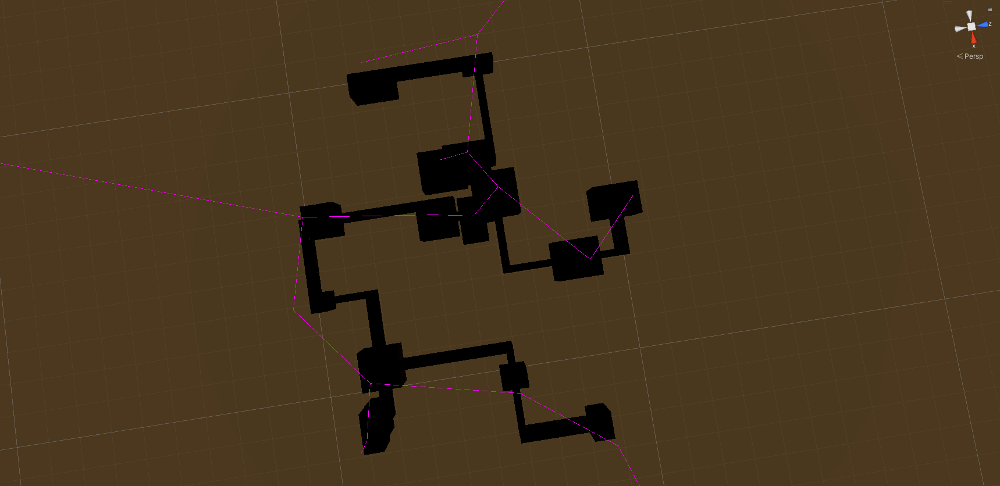

# Physics-Like
A rogue-like centered around physics based gameplay.

# Features

## Dynamic Dungeon Generation

Currently the implementation only exists on a single Y axis, however it can edited to work on multiple levels. The process is as follows:

1. Create a series of random points to plot out the initial rooms, and generate a random scale and width for each room based on user selected properties such as *structure amount*. Do not worry about rooms overlapping as that can create interesting and unique structures. We then use several 1x1x1 blocks to generate floors and ceilings for each room based on the size of each room. We also keep track of the state of each block within a 3D grid.
2. Use the origin of each room to create a Delanuay Triangulation. Due to the nature of this method of creating a mesh or tree, we can ensure that the paths have a decent distance away from each other. Plus it was fun to make.

3. We create a MST from the Delanuay Triangulation tree to ensure that we don't get a large amount of cyclical rooms, however that would be boring, so we grab a few paths from the original tree and append it to this MST.

4. We iterate over the edges in our enriched MST and use an A* path finding algorithm to carve out a path that makes sense within our games world, as we are constructing our rooms from 1x1x1 blocks. 

5. We take the paths outputted by the path finder and create corridors from them from 1x1x1 blocks, and keep track of them in the grid. With this, we have rooms and corridors all interconnected and tracked within our grid, but we don't have walls.
6. We use the grid to check neigbouring cells and see if we want to construct a wall (if theres no neigbour, we make a wall). We keep track of these also.
7. Finally, we have a full dungeon, however we want to optimize things, so we merge every 1x1x1 block together into one large mesh. We keep track of the game objects that make up the world, so we can track whether or not they're affected within our grid and recalculate the large mesh when needed.
